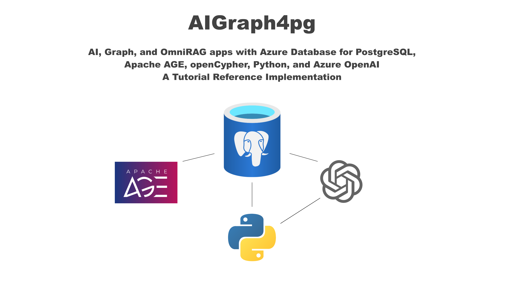

<p align="center">
  
</p>

Home of the **AIGraph4pg** reference application, implemented with
**Azure Database for PostgreSQL**, **Apache AGE**, **pgvector**, and
**Azure Extensions** for both Graph and AI use-cases.

This project is similar to the [CosmosAIGraph](https://aka.ms/caig)
project as it demonstrates the **GraphRAG** and **OmniRAG** patterns,
but with **Azure Database for PostgreSQL** instead of **Azure Cosmos DB**.

## Specifically, this reference application demonstrates the following

- Using the Azure Database for PostgreSQL with **Python**
- Provisioning automation with the **az CLI**
- Vector Search, with **pgvector**, in Azure Database for PostgreSQL 
- Vector Search, with **DiskANN**, in Azure Database for PostgreSQL  (v2)
- Using JSON data in Azure Database for PostgreSQL with the **JSONB** datatype
- In-database embeddings generation with the **azure_local_ai** extension and a SLM (v2)
- Graph Database functionality with the **Apache AGE** extension and **openCypher**
- Combining the above into an AI-powered **GraphRAG/OmniRAG** solution
- A minimal working **Web UI** to demonstrate these concepts

The intent of this reference application is to be an **open-source solution accelerator**
for customers, as they may copy this code and modify it as necessary 
per the needs of their workloads.

This reference application will also strive to demonstrate ongoing new
innovative features in Azure Database for PostgreSQL, especially in AI.

## What is Apache AGE ?

> Apache AGE is a PostgreSQL extension that provides graph database functionality. 
> AGE is an acronym for A Graph Extension, and is inspired by Bitnine’s fork of PostgreSQL 10,
> AgensGraph, which is a multi-model database. The goal of the project is to create single storage
> that can handle both relational and graph model data so that users can use standard ANSI SQL 
> along with openCypher, the Graph query language.

The above quote is per https://age.apache.org/age-manual/master/intro/overview.html#

Apache AGE is now a supported extension in **Azure Database for PostgreSQL - Flexible Server**,
and its functionality is demonstrated in this GitHub project.

## What's in this Project?

- Curated and vectorized datasets that are ready to use
- Scripts and DDL for creating your Azure Database for PostgreSQL objects
- Python application code containing both Console-App and Web UI functionality
- Docker build scripts, a public DockerHub image, and a Docker Compose script

This reference application uses **Azure cloud-based data services**
but the **application code runs from your desktop**, for demonstration purposes.
The application code can run either as a Python process, or a Docker image.

### Project Directory Structure

```
Directory/File             Description

├── az                     az CLI deployment script for Azure PostgreSQL
├── data
│   ├── cypher             Generated statements, zipped, to load the Apache AGE graphs
│   ├── openflights        Smaller dataset of US Air travel
│   └── pypi               The primary curated dataset of 10,000+ Python libraries
├── docs                   User documentation, quick start, faq, etc
└── python                 The Python-based implementation
    ├── docker             Dockerfile and docker-compose.yml for local desktop execution
    ├── htmlcov            Unit test code coverage reports; git-ignored
    ├── ontologies         Unused, reference OWL file from the CosmosAIGraph project
    ├── sql                Miscellaneous SQL, DDL, indexing scripts
    ├── src                The primary Python source code
    ├── static             Static assets used in the Web app
    ├── templates          Jinga2 templates used in text generation
    ├── tests              Unit tests
    └── views              Web app HTML views/templates
    ├── main.py            The "console app" part of this application
    ├── requirements.in    The base list of Python requirements, used by venv.ps1/venv.sh
    ├── venv.ps1           Windows PowerShell script to create the Python virtual environment
    ├── venv.sh            Linux/macOS script to create the Python virtual environment
    ├── webapp.py          The Web application, built with the FastAPI framework
    ├── webapp.ps1         Windows PowerShell script to start the Web app
    └── webapp.sh          Linux/macOS script to start the Web app
```

## What's not in this Project?

- Bicep or other scripts to deploy the application code to Azure

## Project Links

- [Quick Start](docs/quick_start.md)
- [Documentation Index](docs/README.md)
- [Frequently Asked Questions (FAQ)](docs/faq.md)

## Project Roadmap

- November 2024: Initial Release
  - Completed:
    - DB load process
    - Vector search with pgvector 
    - Embedding generation with Azure OpenAI
    - Graph creation with Apache AGE
    - Web UI for traditional SQL queries
    - Web UI for vector search SQL queries
  - TODO:
    - Richer openCypher queries
    - Web UI for graph queries with openCypher, and visualization with D3.js
    - Docker image on DockerHub

- TBD: Optimize DB load process
- TBD: Generative AI for openCypher queries
- TBD: DiskANN vector search
- TBD: In-database vectorization with a SLM
- TBD: Fabric Mirroring integration
- TBD: Integrate ongoing Azure Database for PostgreSQL innovation

