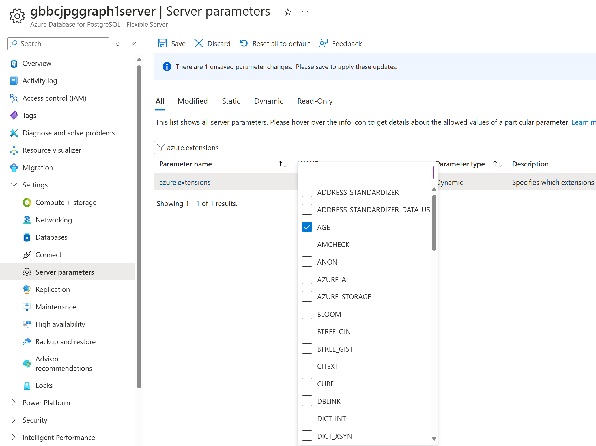
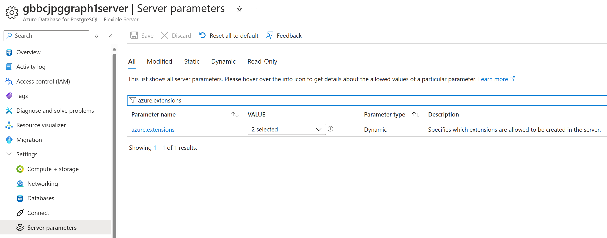
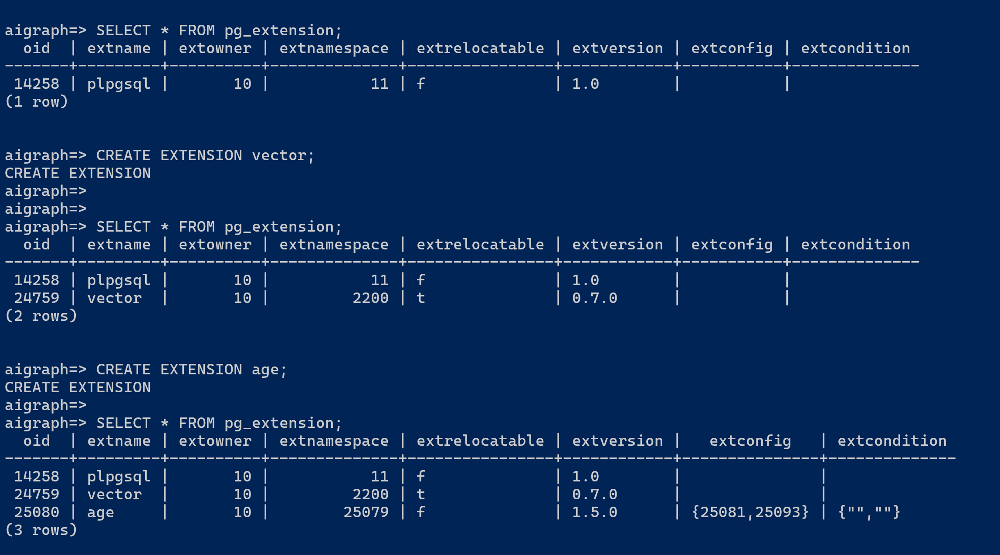

# AIGraph4pg - Configuring and Using PostgreSQL Extensions

In this project we'll use the **vector** and **age**.


## Links

- https://learn.microsoft.com/en-us/azure/postgresql/flexible-server/how-to-use-pgvector
- https://learn.microsoft.com/en-us/azure/postgresql/flexible-server/concepts-extensions#how-to-use-postgresql-extensions
- https://learn.microsoft.com/en-us/azure/postgresql/flexible-server/concepts-extensions#extension-versions

## Process

- First **enable** the use of the extension(s) in Azure Portal
- Then **create** the extension(s) in your database in a **psql** session

These are shown below.

### Enabling the PostgreSQL Extensions 

You can do this in **Azure Portal** as follows:

- Navigate to your Azure PostgreSQL account
- Select **Settings -> Server parameters** in the left nav
- Search for the name **azure.extensions**
- Select VECTOR and AGE from the dropdown list, and click Save

<p align="center">
  
</p>

<p align="center">
  
</p>

### Creating the Extensions in a psql shell

First, query the initial list of extensions.

```
aigraph=> SELECT * FROM pg_extension;
  oid  | extname | extowner | extnamespace | extrelocatable | extversion | extconfig | extcondition
-------+---------+----------+--------------+----------------+------------+-----------+--------------
 14258 | plpgsql |       10 |           11 | f              | 1.0        |           |
(1 row)
```

Next, enable the **vector** extension (aka - pg_vector) and list the extensions.

```
aigraph=> CREATE EXTENSION vector;
CREATE EXTENSION
aigraph=>
aigraph=>
aigraph=> SELECT * FROM pg_extension;
  oid  | extname | extowner | extnamespace | extrelocatable | extversion | extconfig | extcondition
-------+---------+----------+--------------+----------------+------------+-----------+--------------
 14258 | plpgsql |       10 |           11 | f              | 1.0        |           |
 24759 | vector  |       10 |         2200 | t              | 0.7.0      |           |
(2 rows)
```

Next, enable the **age** extension (aka - Apache AGE) and list the extensions.

```
aigraph=> CREATE EXTENSION age;
CREATE EXTENSION
aigraph=>
aigraph=> SELECT * FROM pg_extension;
  oid  | extname | extowner | extnamespace | extrelocatable | extversion |   extconfig   | extcondition
-------+---------+----------+--------------+----------------+------------+---------------+--------------
 14258 | plpgsql |       10 |           11 | f              | 1.0        |               |
 24759 | vector  |       10 |         2200 | t              | 0.7.0      |               |
 25080 | age     |       10 |        25079 | f              | 1.5.0      | {25081,25093} | {"",""}
(3 rows)
```

#### Screen shot of the above psql session in Windows PowerShell

<p align="center">
  
</p>


One way to create a psql session is to use the **psql.ps1**
script in this repo.
